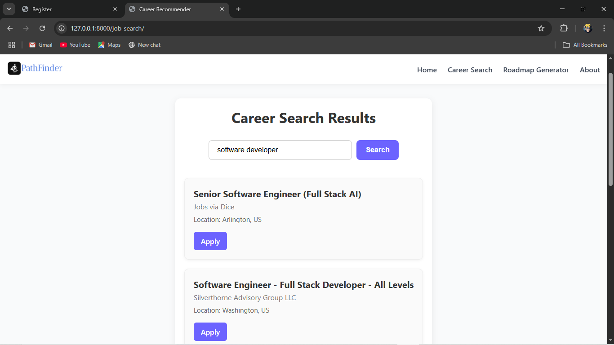
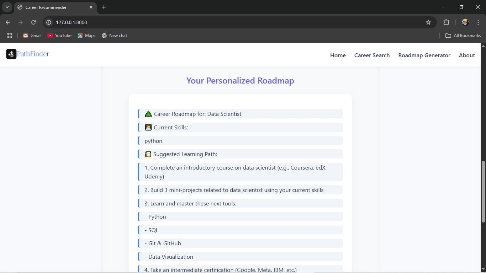
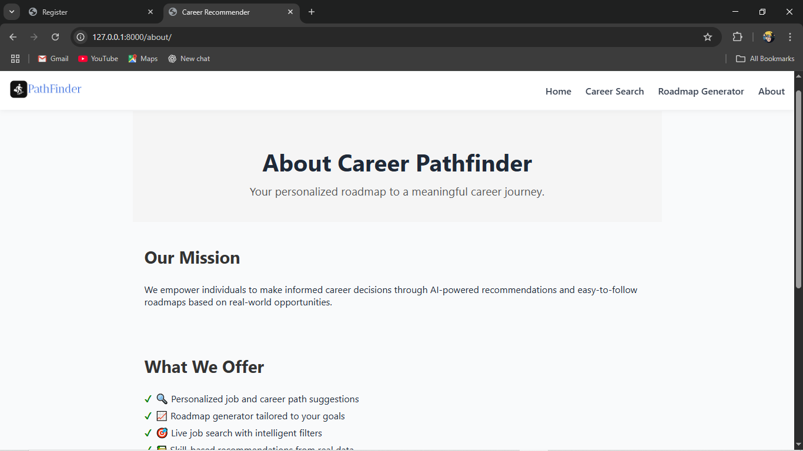
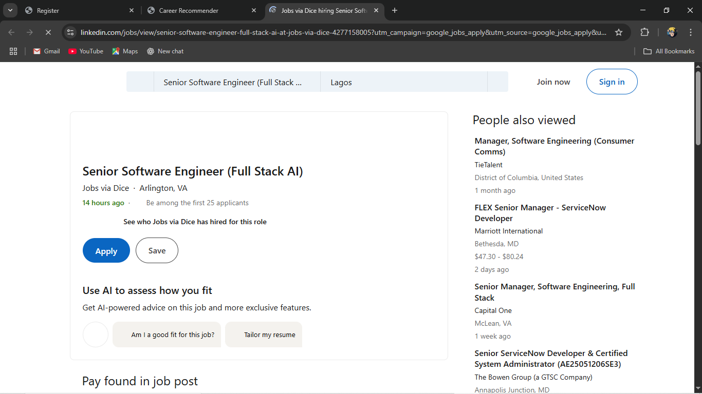
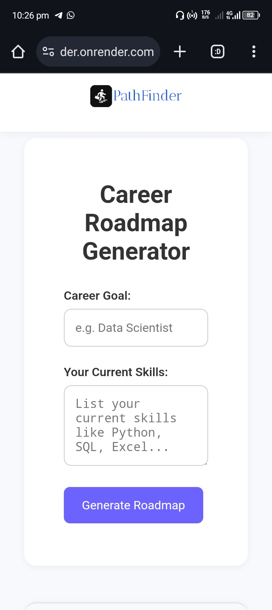
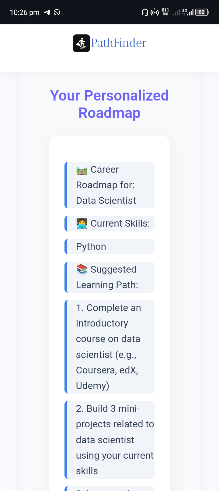

# Pathfinder: Career Roadmap & Search Recommender

A smart web-based platform that helps users discover potential career paths, visualize roadmaps, and explore relevant job roles based on their interests or skills. Whether you're a student, a job seeker, or someone looking to pivot careers, Pathfinder helps you make informed decisions with AI-assisted insights.

## 🚀 Features

- Career Path Suggestions: Input your interests or skills, and receive AI-driven suggestions for relevant career paths.
- Dynamic Roadmap Generator: Visual representation of the skills, tools, and milestones needed to pursue a specific career.
- Live Job Search Integration: Real-time job opportunities fetched using external APIs like RapidAPI (Google Jobs).
- Responsive Interface: Clean and modern UI built for desktop and mobile users.
- Modular Design: Easily extendable for adding more paths, features, or domains.

## 🛠 Tech Stack

- Backend: Django (Python)
- Frontend: HTML, CSS (custom), JavaScript
- Database: PostgreSQL
- Job API: RapidAPI (Google Jobs integration)
- Deployment: Render
- Version Control: Git & GitHub

Screenshots

  
Landing page for exploring career options

  
Career or Job Seatch Page

  
Roadmap Geneartor Page

  
Roadmap Result

  
About Page

  
Searched Jobs/Career Application (third party)

  
Mobile view 

  
Mobile view

