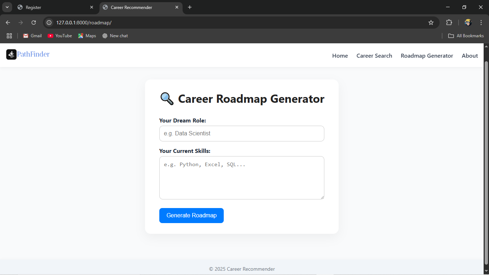

# Improved Career Recommender System- (Will Upload soon)
The Career Recommender System is a personalized platform designed to help users discover the best career paths based on their skills, interests, 
and learning preferences. Whether you're a student, job seeker, or professional looking to pivot, this system gives intelligent suggestions to help 
you plan your career path with confidence.

Features

- Smart Career Path Recommendations
  Get personalized career suggestions based on your input.
- Learning Resource Suggestions
  Get matched with books, videos, and learning materials aligned with your goals.
- AI-powered Matching
  Built with content-based filtering and Pinecone vector search for relevance.
- Responsive UI
  Fully optimized for desktop and mobile devices.
- Authentication 
  User registration and login system powered by Django.

Technologies Used

- Backend: Django + PostgreSQL  
- Frontend: HTML, CSS (custom)  
- APIs**: Open Library API, YouTube API, Pinecone  
- Deployment: Render

Screenshots

  
Landing page for exploring career options

  
Career or Job Seatch Page

  
Roadmap Geneartor Page

  
Roadmap Result

  
About Page

  
Searched Jobs/Career Application (third party)

  
Mobile view 

  
Mobile view

